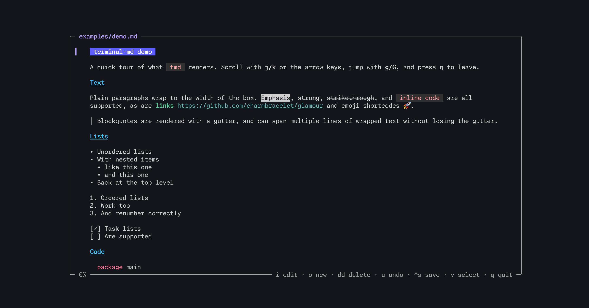

# Kitchen sink

Every construct `tmd` should render. Setext headings, too:

Setext level one
================

Setext level two
----------------

## Inline

*emphasis*, _emphasis_, **strong**, __strong__, ***both***, ~~struck~~,
`code`, ``code with ` backtick``, a [link](https://example.com "title"),
an autolink <https://example.com>, a bare URL https://example.com,
a footnote reference[^1], an image , a hard  
line break above (two trailing spaces), and escaped \*asterisks\*.

## Math

Inline math: the area is $A = \pi r^2$, Euler's identity $e^{i\pi} + 1 = 0$,
a fraction $\frac{1}{2}$, subscripts $x_i + y_{ij}$, and $\sqrt{x^2 + y^2}$.

Display math:

$$
\sum_{i=1}^{n} i = \frac{n(n+1)}{2}
$$

$$
f(x) = \begin{cases}
  x^2 & \text{if } x \geq 0 \\
  -x  & \text{otherwise}
\end{cases}
$$

Not math: it costs $5 and $10 today, and `$x$` in code stays literal.

## Lists

1. First
2. Second
   1. Nested ordered
   2. Another
3. Third with a
   continuation line

- Bullet
  - Nested bullet
    - Deeper
- [ ] Todo
- [x] Done

Term
: Definition of the term.

## Quotes

> A quote.
>
> > Nested quote with **bold**.
>
> - a list in a quote

## Code

```python
def hello(name: str) -> str:
    return f"Hello, {name}!"
```

    indented code block

~~~
tilde fence
~~~

## Tables

| Left | Center | Right |
|:-----|:------:|------:|
| a    |   b    |     c |
| long cell text | `code` | **bold** |

## HTML and misc

<details><summary>HTML block</summary>inner</details>

Some <kbd>Ctrl</kbd>+<kbd>S</kbd> inline HTML.

***

Emoji :tada: and unicode — “quotes”, café, 日本語.

[^1]: The footnote text.
